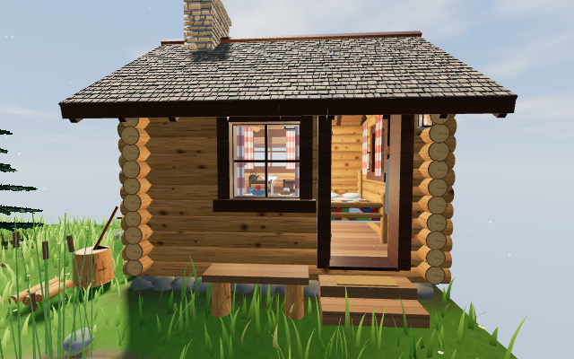

# Meadow Pond

A first-person, fully procedural meadow built with [three.js](https://threejs.org/): a hand-tuned 10 × 10 m
diorama in the middle of a 100 × 100 m island of rolling hills, spruce groves, apple trees, boulders and beaches.
Every mesh and texture is generated in code — there are no model or image files.



**In the scene:** a pond with lily pads, reeds and animated caustics · a Norway spruce with pinecones ·
an apple tree whose crown is made only of individual leaves · a rose bush with spiral-petal roses ·
a stepped sandstone outcrop with moss, lichen and ferns · a furnished, enterable log cabin with a
crackling fireplace, lamps and a working door · wind-blown grass and flowers · butterflies, pollen and
fireflies · a full day/night cycle with stars and moonlight · around it, a seeded island: rolling hills,
spruce groves and apple trees with three levels of detail, boulders, sandy beaches, the sea,
camera-following GPU grass and distance fog.

## Quick start

The project runs straight from the source files; no build step is required.
ES modules must be served over HTTP (opening `index.html` from disk will not work):

```bash
# any static server works, for example:
npx serve .
# or
python3 -m http.server 8000
```

Then open the printed address (for example `http://localhost:8000`).

### With Vite (optional, for hot reload and production builds)

```bash
npm install
npm run dev       # dev server with hot reload
npm run build     # production build into dist/
npm run preview   # serve the production build
```

### Deploy to GitHub Pages

A workflow is included in `.github/workflows/pages.yml`. Push to `main`, then enable
**Settings → Pages → Source: GitHub Actions**. The site is published as-is (no build needed).

## Controls

| Desktop | Touch | Action |
| --- | --- | --- |
| Click the scene, move the mouse (or drag) | Drag on the right half | Look around |
| `W` `A` `S` `D` / arrow keys | Drag on the left half (joystick) | Walk (or fly) where you look |
| `G` | Movement button in the panel | Switch between walking on the terrain and free flight |
| `Space` / `E`, `Q` / `C` | Jump / Up / Down buttons | Jump; rise, sink when flying |
| `Shift`, mouse wheel | Speed slider | Boost, set speed |
| `F` near the cabin door | Door button | Open / close the door |
| `L` | Cabin lights switch | Cabin lights on / off |
| `E` / click | Tap the item | Pick up what you aim at |
| `F` / right click | Use button | Use the selected item (eat, throw, cook, place) |
| `1`-`4`, wheel | Tap a slot | Select a quick slot |
| `R` | Seat button | Sit down / stand up (benches, logs, the porch bench) |
| `X` | Fire icon beside it | Light / put out a fire, lamp, candle or lantern |
| `T` | The icon beside it | Take / put back the hand lantern, draw water at the well, sow or harvest a garden plot |
| `V` | Curtain button | Open / close the curtains of the window you look at |
| `B` | Boat button | Board, anchor, weigh anchor, leave the boat |
| `H` | Fish button | Cast, reel in; tap to strike |
| hold `Z` | Hold the fast-forward button | Time-lapse while sitting or in bed |
| `` ` `` | Stats button (top right) | Debug overlay: FPS, draw calls, triangles |
| `Esc` | | Release the mouse |

The panel also sets the **time of day** (04:30 – 23:30) and **wind** strength.

## Project structure

```
index.html                  Page markup, UI overlay, import map for three.js
styles/main.css             UI styling (intro card, panel, touch controls)
src/
  main.js                   Entry point: builds the world in order and runs the render loop
  config.js                 Every tunable of the 100 x 100 m world (size, seed, grass, trees, LOD, shadows, fog, player)
  engine/
    createEngine.js         Renderer (ACES, sRGB, soft shadows), scene with fog, camera, resize
    finalizeScene.js        Post-build pass: point-light masking, cloud shadows, program cache keys, instanced culling bounds
    mergeStatic.js          Merges static meshes sharing a material (the cabin: ~350 meshes -> ~95 draws)
    detailManager.js        Distance bands (checked 4x a second, 15% hysteresis) that switch visibility / per-frame work
  core/                     Reusable, scene-independent helpers
    random.js               Seeded PRNG (rng, rr, setSeed)
    math.js                 V (Vector3), UPV, clamp, smooth, lin (sRGB → linear colour)
    noise.js                hash / value noise / fBm in 2D and 3D
    geometry.js             weld, blobGeo, paint, mergeGeos, limb, joint
    canvasTexture.js        canvasTex: draw a texture with the 2D canvas API
    uniforms.js             Shared shader uniforms (time, wind, sun)
    shaderPatches.js        addFlutter / addWorldSway / addPlantSway / addThinning / addDistanceFade / addCloudShadow patches
    env.js                  isTouch (quality scaling)
  world/                    The site itself
    layout.js               Site plan: asset positions, H(x, z) (diorama inside the plot, hills, beach and
                            sea floor outside), coastline, forest density, exclusion zones, cabin -> pond path
    sharedTextures.js       Textures used by several assets (bark, leaf, needles, ground detail, sprite)
    sky.js                  Sky dome, clouds, stars, moon, PMREM environment map
    lights.js               Sun/moon light, shadow box that follows the player, hemisphere fill
    terrain.js              Plot ground mesh + caustics; island heightmap mesh, grass/dirt/rock/sand shader
    grass.js                World GPU grass: camera-following rings of clumps, distance falloff, wind
    scatter.js              Seeded tree + rock scatter, per-tree distance thinning, 8-angle billboard atlases
    plotDetail.js           The original plot's assets on the detail manager, with the island's distance rules
    undergrowth.js          Bushes, wild roses, fallen logs + stumps, ferns, mushrooms, sticks, cones, meadow flowers,
                            pollen / fireflies around the camera
    bounds.js               Soft boundary (wading depth at the shore, world edge when flying), trunk and boulder grids
    soilSkirt.js            Soil cross-section of the old diorama edge (no longer built)
    timeOfDay.js            Day/night cycle, fog colour
  assets/                   One factory per scene element
    water/     pond.js (pond + the sea), lilyPads.js, reeds.js, waterLife.js (fish rises, dragonflies)
    trees/     spruce.js, appleTree.js        (full-detail generator, the reference tree, island variants)
               fallenLog.js                   (fallen trunk + the stump it broke from, near / far meshes)
    vegetation/grass.js, meadowFlowers.js, roseBush.js (+ wild rose variants), bush.js, forestFloor.js
    rocks/     rockOutcrop.js (+ boulder, finishRock), scatteredRocks.js (+ createRockVariants)
    fauna/     butterflies.js, pollen.js
    cabin/     cabin.js     (structure, fireplace, furniture, props, lights, door)
  app/
    controls.js             Walk / fly controls, touch controls, settings panel, collisions
    debugOverlay.js         FPS / draw call / triangle overlay
standalone/meadow-pond.html The original single-file build (reference / fallback)
```

## How assets work

Each asset module exports a factory that receives a shared context and adds its meshes to the scene:

```js
export function createRoseBush(ctx) {
  const { scene } = ctx;       // also available: renderer, camera, maxAniso, canvas
  const { leafTex } = ctx.tex; // shared textures from world/sharedTextures.js
  // ...build geometry and materials, scene.add(...)
  return { /* anything the render loop needs */ };
}
```

- **Positions** come from `src/world/layout.js` (for example `ROSE`, `ROCK`, `HOUSE`), and ground height
  from `H(x, z)`. Move an asset by editing its entry there. Grass, flowers and terrain colouring read the
  same values, so they stay consistent.
- **Randomness** comes from one seeded stream (`src/core/random.js`). The build order in `src/main.js`
  therefore defines the exact look. Adding or reordering assets changes the variation of later ones;
  call `setSeed()` before a builder if you want an asset to be independent of the others.
- **Animation**: factories return what the loop needs (for example `createCabin` returns
  `update(dt, t)`, `createPollen` returns `update(t)`), and `main.js` calls these every frame.
- **Collisions**: the camera collides with `rockColliders` (ellipsoids, see `layout.js`), tree trunks,
  and the cabin's boxes and roof (see `app/controls.js`).

### Adding a new asset

1. Create `src/assets/<group>/<name>.js` exporting `create<Name>(ctx)`.
2. Add its position to `src/world/layout.js` (and, if it should clear grass, exclude it in
   `assets/vegetation/grass.js` like `inRose` / `inRocks`).
3. Import it in `src/main.js` and call it after the existing builders (to keep the current look intact).
4. Outdoor `MeshStandardMaterial`s are picked up automatically by `finalizeScene`
   (they ignore the cabin's interior point lights and get the drifting cloud shadows).

## The world around the plot

- **Terrain** (`world/terrain.js`, `world/layout.js`): `H(x, z)` is the original diorama height inside
  `|x|, |z| < CONFIG.world.coreHalf` and blends into seeded fBm hills outside. The hills run down to a beach at a
  noisy coastline (`coastDist`, `CONFIG.island`) and on to the sea floor. The world mesh is one 200 x 200
  heightmap cut out under the plot, whose finer ground mesh stays as it was. One shader blends grass (vertex
  colour x detail texture), dirt / forest floor, rock by slope and sand near sea level.
- **Sea** (`createOcean` in `assets/water/pond.js`): one opaque plane at `CONFIG.island.seaLevel` (below the plot's
  pond basin) that follows the camera; colour from the water depth (read from the grass ground texture), shore foam
  (from `waterLife.js`), world-space waves, fog into the sky's horizon colour. Walking deeper than `wadeDepth`
  eases you back to shore.
- **Grass** (`world/grass.js`): only outside the plot (the plot keeps its 64k blades). Density matches the plot
  (`CONFIG.grass.density`: 300 blades/m2 on touch, 640 on desktop) out to 8 m, then falls off continuously as
  `d(r) = full * ((18 - r) / 10)^2`, clumped with low-frequency noise. The vertex shader drops a blade when its
  threshold exceeds `d(r)`, reading height and density from a baked half-float texture; nothing is rebuilt on the
  CPU. Camera-following rings only set the geometry cost (cell size from the density at each ring's inner edge,
  cheaper blades further out); each cell shifts its blade layout by its own hash so no grid shows. Rings are split
  into 8 sectors so the ones behind the camera are culled.
- **Trees and rocks** (`world/scatter.js`): seeded Poisson-style placement driven by `forest(x, z)` (groves between
  the meadow and the beach, spaced at least `minSpacing` apart), kept off the beach and out of `EXCLUSIONS`
  (plot, cabin yard, pond, cabin -> pond path; push more to add zones).
  Every island tree uses the **reference generators** (`buildSpruce`, `buildApple`) at full detail: each species has
  `CONFIG.trees.variants` differently seeded variants, built once in tree-local space. A tree is a small group of
  meshes sharing its variant's geometry, card buffers and materials; its position, rotation and scale are in its
  modelMatrix. Every part has a detail rank (outer / silhouette cards low, twigs and fruit high) and parts are
  stored sorted by rank, so detail thins continuously with distance: keep(d) = 1 up to `CONFIG.trees.keep[0]`, easing
  out to `keep[2]` at `keep[1]`; each tree draws only its first N cards / vertices (one binary search per tree per frame) and
  the shader collapses the rest (`addThinning`, also in the shadow pass); surviving cards grow slightly. Past `CONFIG.trees.fade[0]`
  the tree dissolves (screen-space dither) into a camera-facing billboard baked at load from 8 angles per variant.
  Pinecones switch to a 32-scale version of the same cone past 6 m.
  Boulders use the same draw logic: the reference outcrop's `boulder` + `finishRock` (sandstone, moss, lichen) at
  full detail near the camera (one mesh per rock, `CONFIG.rocks.nearDetail`), dithered into an instanced low-detail
  mesh of the same shape past `CONFIG.trees.fade`. Each boulder collides as a rotated ellipsoid fitted to its mesh
  (`rockBodies` in `bounds.js`): when walking you step onto rocks whose peak is within `player.stepHeight` of your
  feet and are pushed around taller ones. A variant is a plain
  `{ height, width, bounds, parts: [{ geometry, material, depth, instances? }] }` object, so GLB models can replace
  the procedural ones.
- **Undergrowth** (`world/undergrowth.js`, `CONFIG.undergrowth`), placed after the trees and rocks and avoiding them,
  with the same draw logic:
  - leafy bushes (`bush.js`) in and along the woods and wild roses (the reference `buildRose`, 14 canes, merged into
    four meshes) on the meadow side of forest edges: full-detail variants planted like the trees, thinned by rank and
    dissolved into 8-angle billboards over a shorter range (`undergrowth.keep` / `fade`: 8 m, billboards by 11 m);
  - fallen trunks, each lying beside the stump it broke from (matching splinters, end grain, root flares, branch
    stubs, moss, bracket fungi, boletes and fly agarics): a near mesh cross-faded into an instanced far mesh like the
    boulders; the stump collides like a trunk and the log as a chain of ellipsoids (low ones can be stepped on);
  - ferns (the outcrop's fronds), boletes, fly agarics, sticks, spruce cones under the spruces and the plot's meadow
    flowers (same geometry, tints and patch noise): one InstancedMesh per kind whose buffer holds only the 8 m tiles
    near the camera (refilled every 1.5 m of movement), dithered out with `trees.fade`;
  - butterflies (the plot's wings and flight): 3-5 around every wild rose and a few spread over the meadow
    (`butterfliesPerRose`, `meadowButterflies`), drawn only within `butterflyRange` (4 m) of the camera, where they
    shrink in over the last metre; one instanced draw per wing style, none when no butterfly is near;
  - pollen by day / fireflies at night in a box around the camera, sharing the plot's pollen material so the
    time of day drives both (the plot keeps its own).
- **Plot detail** (`engine/detailManager.js`, `world/plotDetail.js`, `CONFIG.detail`): the original plot follows the
  island's rules. Nothing changes within `trees.fade[0]` (15 m). Beyond it, the reference spruce, apple tree and rose
  bush dissolve (dither) into an 8-angle billboard baked from themselves by `trees.fade[1]` (19 m); reeds, meadow
  flowers, the outcrop's ferns, lily pads and the plot grass dissolve per instance / blade on the GPU; the cabin
  interior dissolves over `detail.interior` from the cabin, keeping its lamp and fire glows so the windows still glow,
  and pauses the fire flicker, sparks and clock; the plot's pollen stops beyond `detail.pollen`, its butterflies follow
  the island's 4 m rule. Terrain, pond, cabin exterior, chimney smoke, the outcrop rock and stones always draw. The
  manager only switches things once they are fully faded, a few times a second with hysteresis; lights are never
  toggled (intensity only), and every shader is compiled once at load (`renderer.compile`).
- **Stream** (`STREAM` in `world/layout.js`, water and stones in `assets/water/stream.js`, sound in `audio/ambience.js`):
  from the pond's south-east rim past the cabin, north through a low valley and down three rapids to a sandy inlet on
  the beach, ~33 m. A curved course; along it the water level steps down from the pond's level to the sea through
  pools and rapids, and `H(x, z)` carves a bed and banks into the terrain (`H0` is the uncarved ground, which the plot's
  builders use for their placement decisions so their random draws, and so the reference trees, are unchanged). One
  flowing water ribbon (faster, foaming over the rapids), rocks in the rapids, pebbles on the banks; trees, bushes and
  grass keep clear; a babbling sound from its nearest point, a rush by the rapids.
  Sedge clumps, cattails and ferns grow in patches along both banks.
- **Footbridge, paths and benches** (`BRIDGE`, `FOOTPATH`, `BENCHES`, `SEATS` in `world/layout.js`; meshes in
  `assets/cabin/footbridge.js` and `assets/cabin/benches.js`): a wooden footbridge crosses the pool below the first
  rapid. Stepping stones lead from the cabin steps to it, and from it to two viewing benches on the crests above the
  beaches: a split-log bench facing the sunrise (east) and a plank garden bench facing the sunset (west). Each has a
  small lantern that lights with the cabin's lights (glow and a warm pool on the ground, no real light). The bridge deck
  is walkable; the benches (and the cabin's bench) are solid. Island trees, rocks and undergrowth that would stand on a
  path, the bridge or a bench are dropped after placement, so nothing else on the island moves.
- **Jetty and sailboat** (`JETTY` in `world/layout.js`; `assets/water/jetty.js`, `assets/water/sailboat.js`): a wooden
  jetty on the east beach below the sunrise bench, reached by a path that branches off the sunrise path. It has a
  wider head with bollards, a crate with a fishing net and a coil of rope, side stairs down to the sand where the deck
  stands high, and a lamp post whose lantern lights with the cabin's lights. The deck and stairs are walkable. A little
  sailboat (white hull, burgundy and red trim, red jib, wooden ship's wheel) lies moored at the head.
- **Sailing** (`app/boating.js`, `CONFIG.boat`): the boat button (B on desktop) boards the boat by the jetty (step down
  to the wheel) or from the shore when it has run aground (you jump in). The left joystick or W / S sets the speed, and left / right turns the wheel, which only turns the boat while
  it moves and springs back when released. The top speed is 2 m/s in a calm (reached in 4 s) plus what the wind and the
  angle to it add, up to 4.5 m/s; the boom and mainsail swing out away from the wind and across in a turn, and the boat heels. Beyond
  `maxOffshore` from the shore the boat turns itself back. Near the
  berth the button docks it (it brings itself in and ties up), then leaves it onto the jetty; elsewhere you can leave
  only where land is within a jump.
- **Wind** (`world/wind.js`, `CONFIG.wind`): the wind holds a random strength (leaning strong) and direction for 30-60
  in-game minutes, then shifts to the next over 10 minutes. Grass, trees, clouds and the boat all follow it. The panel's
  Wind slider follows it too, and dragging it overrides the strength; the wind carries on changing from there.
- **Items** (`app/items.js`, `app/inventory.js`, `app/itemKinds.js`, `assets/vegetation/forage.js`, `CONFIG.items`):
  - What you can pick up: apples (off the reference tree, under it, and windfalls under the island's apple trees),
    spruce cones, sticks, berries (on some island bushes), rose petals (fallen, or a few a day off any rose bush),
    pebbles (in the stream, on the beaches and the meadow), boletes (the brown forest mushrooms; not the fly agarics,
    none in winter), shells and driftwood (on the beaches). One shell in 10 000 (`CONFIG.items.rareShell`) is a
    nautilus, a keepsake for the cabin's shelf.
  - Aim at one with the middle of the screen, within reach (crouching or reaching up), and tap, click or press E.
    It glows while aimed, flies to you and lands in one of four quick slots at the top (up to 10 each; keys 1-4 or the
    wheel select).
  - Use (the button above Jump, right click or F) eats apples, berries and cooked food, throws pebbles, shells, cones,
    sticks and driftwood (they splash into water or lie where they land), lets petals drift off on the wind, and says
    what to do with the rest (cook raw fish and boletes; put keepsakes on the shelf).
  - What you take comes back after an in-game day. The inventory and what is taken are saved in the browser.
- **Chest** (`CHESTS` in `world/layout.js`, `assets/cabin/chest.js`, `app/chestUI.js`, `CONFIG.chest`):
  - A wooden sea chest by the woodpile on the cabin's west wall.
  - Near it and looking at it, its lid creaks open and an open-chest icon floats over it; tap it (click or E on
    desktop) to open the storage.
  - The storage screen has 10 tiles and your 4 quick slots. Tap a stack to lift it and tap where it goes: the same
    kind fills up to 10, another kind swaps. A long press picks how many to lift and shows the item's name.
  - Close it with the cross, a tap on the scene, or by walking away. Each chest keeps its own contents in the browser.
- **Sleeping** (`app/sleeping.js`, `BED` in `world/layout.js`, `CONFIG.sleep`): inside the cabin, near the bed and with it
  in view, the bed button lets you sleep once 14 in-game hours have passed since you last did. You sit on the edge, turn
  and lie back looking up, tilted to one side. The screen fades to black and the clock moves on 7-9 hours, and you wake
  still lying, with stand and sit buttons. Earlier than that, you only sit on the edge and a photo album opens: a book
  whose pages you swipe (placeholder symbols for now). Sitting shows stand, and sleep too once it is allowed.
- **Sitting** (`app/controls.js`, `CONFIG.player.sit`): in front of a bench the seat button (R on desktop) turns you to
  it, walks you up, turns you round and sits you down; seated you can only look around; the stand button raises you and
  gives the controls back.
- **Fires** (`app/fires.js`, `CONFIG.fire`): near a fire, lamp, candle or lantern and looking at it, it glows softly and
  an icon floats beside it (as when picking things up); tap it (X on desktop) to put it out or light it. Lamps, candles
  and lanterns go on and off at once, each on its own; the Lights switch still does them all. Lit, the flames catch over 4 s; put out, they die down over 1.6 s, and the embers glow (and the chimney
  smokes) for 45 s more. Flames, light, sparks, ember glow, smoke and crackle all follow. Each fire's state is remembered.
  Every fire registers with `fires.add()` in `main.js`: the cabin's fireplace and the three firepits.
- **Firepits** (`assets/cabin/firepits.js`, sites `FIREPITS` in `world/layout.js`): one on the beach by the jetty (just
  a ring of stones on the sand), one in a clearing of the north-west woods, one on the south-west hill. The two inland
  ones have three cut logs to sit on (the seat button, as at the benches) and a roofed woodpile within 5 m that gives up
  to 10 sticks a day (`CONFIG.items.pileSticks`). They start cold; lighting one takes 3 sticks, cones or driftwood from
  what you carry (the icon shows the cost, and a note says so when you lack them). You can light or put out a fire while
  sitting on a log. No real lights: flames, a glow, a warm pool on the ground (dimmer by day), sparks and smoke, and the
  crackle of the loudest lit fire. A stepping-stone path leads from the sunset path to the forest firepit.
- **Fishing** (`app/fishing.js`, `CONFIG.fishing`): on the jetty's head, or aboard the anchored boat, looking out over
  deep water, the fish button (H) casts: the rod shows in your hand and the float lands 6 m out. After 5-25 s (half
  that around sunrise and sunset) it dips with a splash: tap Strike (or anywhere) within 1.1 s to hook the fish and
  reel it in; miss it and the float waits again. The button reels in empty while you wait. One catch in 100 is a
  golden fish. 40 % of hooked fish slip off the hook (`CONFIG.fishing.fail`). Raw fish cooks into grilled fish.
- **Anchor** (`app/boating.js`): out on open water, once the boat has nearly stopped, the boat button drops the anchor
  (a splash, a rope from the bow); the boat stays, swinging slowly bow into the wind. The same button weighs anchor.
- **Keepsake shelf** (`app/shelf.js`, `SHELF` in `world/layout.js`): on the cabin's back wall above the nightstand.
  With a keepsake selected (the golden fish, the nautilus shell), near it and looking at it, Use says Place and puts it
  there for good.
- **Seasons** (`world/seasons.js`, `world/seasonLooks.js`, `world/weather.js`, `CONFIG.seasons`): spring, summer,
  autumn, winter, 10 in-game days each; a season only turns while you sleep (the first sleep after its days are up),
  and its name fades in as you wake. The panel's Season picker jumps to any season. Summer is the scene as it always
  was. Spring: a fresher green meadow, the apple trees in blossom, blossom petals drifting down. Autumn: a golden
  meadow, yellow-orange-red apple leaves falling. Winter: snow over the ground and roofs (grass under it, flowers and
  reeds sticking through), bare apple trees and bushes with a little snow, the pond frozen (you can walk on it), a
  greyer sea, snowfall. Days are longer in summer and short in winter, with a lower sun. What you can collect follows
  too: apples in summer and autumn, berries in summer and autumn, rose petals in spring and summer. Materials take part
  by a role in `userData.season`; the shader side is `addSeason` in `core/shaderPatches.js`.
- **Cooking** (`app/cooking.js`, `CONFIG.cook`): sitting on a log at a burning firepit, or standing at the cabin's lit
  fireplace looking in, with a food that cooks selected (`cook` in `app/itemKinds.js`: apple to baked apple, fish to
  grilled fish, bolete to roasted bolete; berries do not cook), the Use button says Cook. A roasting stick (a crooked,
  whittled branch) reaches out from your hand to the fire with the food on its end (2 s), a ring round it fills over
  30 s as it browns, the stick comes back (2 s) and the cooked piece is in your inventory. One piece at a time; standing
  up, walking off or the fire going out stops it and you keep the raw piece. The stick is only shown.
- **Signposts** (`assets/cabin/signposts.js`, `SIGNS` in `world/layout.js`): at the three forks of the paths (the
  bridge, where the jetty path leaves the sunrise path, where the forest path leaves the sunset path), a weathered post
  with an arrow board for each place, pointing along the path, with the name and the distance along the paths burnt in
  on both faces. One mesh and one texture for all of them.
- **Hand lantern** (`app/lantern.js`, `assets/cabin/handLantern.js`, `CONFIG.lantern`): a hurricane lantern at the far
  end of the porch bench. Looking at it, an icon beside it (T on desktop) takes it: it lights and hangs in your right
  hand, swinging as you walk, and at night it lights the ground, grass, trees and rocks round you (one shader light,
  `U.uHandLight`, added to every outdoor material in `engine/finalizeScene.js`; nothing by day). Back at the bench the
  same icon puts it down. Whether you carry it is saved.
- **Well** (`WELL` in `world/layout.js`, `assets/cabin/well.js`, `app/drawWater.js`, `CONFIG.well`): behind the cabin, a
  stone well with a little roof and a windlass. Looking at it, the icon beside it (T) lowers the bucket (the crank
  turns and creaks, a splash far down), winds it back up full, and a cup of fresh water goes into your quick slots
  (Use says Drink).
- **Vegetable garden** (`GARDEN` in `world/layout.js`, `assets/cabin/garden.js`, `app/gardening.js`, `CONFIG.garden`):
  three raised beds behind the cabin, carrots, potatoes and pumpkins, three plots each. Looking at a bare plot, the
  icon sows it (no seeds to carry); it grows by itself over 2 / 3 / 4 in-game days (sleeping counts; nothing grows or
  is sown in winter, when the beds are under snow), then the icon harvests it: 3 carrots (eaten raw), 3 potatoes or a
  pumpkin (both cooked on the stick into baked potatoes and roasted pumpkin). Saved in the browser.
- **Planting** (`app/planting.js`, `assets/trees/sapling.js`, `CONFIG.planting`): with an apple or a spruce cone
  selected, look down at open ground close by (off paths, beaches, water, the plot, and clear of trees, rocks and other
  saplings) and Use says Plant. A seedling comes up and grows over 8 in-game days into a young apple tree or spruce
  (leaves by season, a little snow in winter). Up to 12, saved in the browser. What grows counts in-game hours with
  sleep (`world/gameHours.js`).
- **Animals** (`assets/fauna/rabbits.js`, `squirrels.js`, `frogs.js`, `gulls.js`, shared bits in `animalKit.js`,
  `CONFIG.animals`): rabbits in the meadows nibble, sit up and hop about, and bolt when you come within ~5 m (paler coats
  in winter); red squirrels keep to a spruce each, forage round it, chatter from the bark, dash up it when you come
  close and now and then drop a cone you can pick up; frogs sit on the lily pads and the pond's bank, croak from dusk
  (a throat sac puffs) and leap into the water with a splash when you pass (asleep in winter); gulls stand on the
  jetty's bollards, the crate, the head's edge and the sand, call now and then, and take off with an alarm call when
  you come close, circle and land again. Procedural, instanced (one draw call per kind, the gulls' wings one more),
  with short positional sounds.
- **Curtains** (`app/curtains.js`): inside, looking at a window, the curtain button (V) draws or opens its curtains.
- **Hunger and frost** (`app/body.js`, `CONFIG.body`): a thin bar under the quick slots empties slowly (never below a
  quarter) and eating fills it, cooked food more. In winter, a minute or more outdoors away from a fire frosts the
  screen's edges; a fire, the cabin or hot food thaws it. Both are only shown, nothing happens when they are low.
- **Footsteps** (`audio/footsteps.js`, `CONFIG.steps`): soft steps by what is underfoot (grass, sand, stone, wood, snow,
  ice, shallow water).
- **Music** (`audio/music.js`, `CONFIG.music`, off by default in the panel): a quiet generated piano and pads per season,
  playing a while and resting a while, under the nature sounds.
- **Weather** (`world/skyWeather.js`, `CONFIG.weather`): clear, rain or storms, decided each in-game hour; rain darkens
  the sky, thickens the fog, falls in streaks (snow instead in winter), drums on the roof inside, and puts out the
  firepits; storms add lightning and thunder. Some mornings are foggy, a rainbow can follow rain, and winter nights can
  have northern lights. The panel's Weather picker forces any of them.
- **Time-lapse** (`app/timelapse.js`, `CONFIG.time.lapse`): sitting or in bed, hold the fast-forward button (or Z) and the
  day runs 40 times faster.
- **Progress** (`app/saves.js`): the panel exports it to a file, imports such a file, or resets to a fresh island
  (settings stay).
- **Dynamic resolution** (`engine/dynamicRes.js`, `CONFIG.render.dynamic`): when the frame rate stays under 50 fps the
  pixel ratio steps down (to 65 % at most), and back up when there is room.
- **Loading screen** (`app/paintIntro.js`): a painted view of the island at golden hour behind the start card, with a
  progress bar.
- **Water life** (`assets/water/waterLife.js`, numbers in its `WATER` object): fish rises, a ring spreading about 1 m
  on the sea (0.45 m on the pond) and fading in 2 s, every 4-10 s on each water (sometimes two in a row); on the sea
  they appear 2.5-14 m out from the shore, 5-30 m in front of the camera. Three dragonflies dart and hover over the pond
  by day (instanced bodies and translucent flapping wings), fly off at dusk and come back in the morning. Shore foam
  (added to the sea's shader at its `shore-foam` marker): a band out to 0.6 m of water where a breaking line runs in
  every 7-9 s, slows up the beach and leaves lace that fades, each stretch of coast at its own moment. Each part
  runs only on its detail-manager band (the pond's within 20 m / 15 m); one draw for the rings while any is alive,
  two for the dragonflies.
- **Day cycle** (`world/timeOfDay.js`, `CONFIG.time`): a continuous 24 h day in 18 real minutes, starting at 16:30; the
  panel's time slider follows it (drag to jump) and "Day cycle" pauses it. Sun and sky update 5 times a second, the
  sky's environment map is rebuilt every 4 s around dawn and dusk and every 15 s otherwise; the cabin lights switch on
  at dusk and off after sunrise (the button overrides them until the next change).
- **Atmosphere** (`world/atmosphere.js`, numbers in `ATMO`): the fog thickens smoothly at dawn (2x around 06:00, clear
  by 10:00) and a little at dusk and night, never below the midday density; morning mist (05:00-09:00) in soft layers
  over the pond and the sea near the shore, drifting with the wind and burning off as the sun climbs; a faint shooting
  star every 40-90 s at night; moths at the lit windows at night while the cabin lights are on.
- **Small moments** (`assets/fauna/smallMoments.js`, numbers in `MOMENTS`): around the plot's apple tree, spruce and rose
  bush, within their 15 m full-detail band. A leaf detaches from the apple crown every 6-20 s, flutters down with the
  wind, lies ~20 s and fades (at most 6); every 3-6 minutes an apple (or a spruce cone) drops, bounces, rolls downhill
  and rests (at most 8 of each on the ground, oldest removed first); in windy gusts 2-4 rose petals skip along the
  ground and fade. Uses the plot's own leaf cards, apples, cones and fallen-petal geometry; everything rests on H(x, z)
  (or on the pond's surface).
- **Horizon** (`world/horizon.js`, numbers in `HORIZON`, positions in `CONFIG.horizon`): a lighthouse on a small rock
  ~450 m out (white and red by day; lit lamp room and a slowly turning beam at night) and, every 4-8 minutes, a sailboat
  crossing in 3-4 minutes on a course at least 400 m from any island (hidden at night). Both are far beyond the camera's
  150 m far plane, so each keeps its true position but is drawn scaled down at 100 m on the same line of sight, fogged
  by its true distance at a fifth of the scene fog (like the birds).
- **Cloud shadows** (`core/shaderPatches.js` `addCloudShadow`, `CONFIG.clouds`): one tileable canvas texture of soft
  cloud footprints (`cloudField` in `core/noise.js`, roughly 20-60 m across) lies flat over the world and drifts with the
  wind. `finalizeScene` puts it on every lit material except the cabin interior. It dims only the sun's direct light
  (diffuse and specular) with one texture lookup per fragment, never the sky / ambient light or the cabin's lamps and
  fire; its strength (35% at midday) follows the sun down to nothing at sunset.
- **Build order:** the world is built after every diorama asset and reseeds the random stream with
  `CONFIG.world.seed`, so the plot looks exactly as before and the world can be re-rolled on its own.
- **Tuning:** every number lives in `src/config.js`.

## Technical notes

- **three.js is pinned to r128** (`0.128.0`). The code uses r128 APIs such as `renderer.outputEncoding`,
  `THREE.sRGBEncoding`, `Color.convertSRGBToLinear()` and shader chunk names like
  `lights_fragment_begin`. Upgrading to a newer three.js requires porting those (colour management,
  renamed chunks such as `encodings_fragment` → `colorspace_fragment`).
- Several materials are customised with `onBeforeCompile` (grass wind, water waves, caustics,
  flutter, sway). `finalizeScene` gives each material a unique `customProgramCacheKey`.
- Quality scales automatically on touch devices (`isTouch`): fewer grass blades and leaves,
  smaller shadow maps, no fireplace shadows. World values are in `src/config.js`; plot values in the asset files.
- `renderer.info` in r128 does not count the shadow pass; the Stats overlay counts it separately.
- The world units are metres; the plot spans −5…5 on x and z, the world −50…50 (the island ~37 m radius), with y up.

## License

No license has been chosen yet. Add a `LICENSE` file before publishing if you want others to reuse the code.
