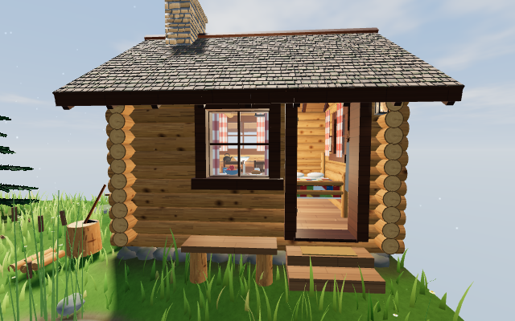

# Meadow Pond

A first-person, fully procedural meadow built with [three.js](https://threejs.org/): a hand-tuned 10 × 10 m
diorama in the middle of a 100 × 100 m island of rolling hills, spruce groves, apple trees, boulders and beaches.
Every mesh and texture is generated in code — there are no model or image files.



**In the scene:** a pond with lily pads, reeds and animated caustics · a Norway spruce with pinecones ·
an apple tree whose crown is made only of individual leaves · a rose bush with spiral-petal roses ·
a stepped sandstone outcrop with moss, lichen and ferns · a furnished, enterable log cabin with a
crackling fireplace, lamps and a working door · wind-blown grass and flowers · butterflies, pollen and
fireflies · a full day/night cycle with stars and moonlight · around it, a seeded island: rolling hills,
spruce groves and apple trees with three levels of detail, boulders, sandy beaches, the sea,
camera-following GPU grass and distance fog.

## Quick start

The project runs straight from the source files; no build step is required.
ES modules must be served over HTTP (opening `index.html` from disk will not work):

```bash
# any static server works, for example:
npx serve .
# or
python3 -m http.server 8000
```

Then open the printed address (for example `http://localhost:8000`).

### With Vite (optional, for hot reload and production builds)

```bash
npm install
npm run dev       # dev server with hot reload
npm run build     # production build into dist/
npm run preview   # serve the production build
```

### Deploy to GitHub Pages

A workflow is included in `.github/workflows/pages.yml`. Push to `main`, then enable
**Settings → Pages → Source: GitHub Actions**. The site is published as-is (no build needed).

## Controls

| Desktop | Touch | Action |
| --- | --- | --- |
| Click the scene, move the mouse (or drag) | Drag on the right half | Look around |
| `W` `A` `S` `D` / arrow keys | Drag on the left half (joystick) | Walk (or fly) where you look |
| `G` | Movement button in the panel | Switch between walking on the terrain and free flight |
| `Space` / `E`, `Q` / `C` | Jump / Up / Down buttons | Jump; rise, sink when flying |
| `Shift`, mouse wheel | Speed slider | Boost, set speed |
| `F` near the cabin door | Door button | Open / close the door |
| `L` | Cabin lights switch | Cabin lights on / off |
| `E` / click | Tap the item | Pick up what you aim at |
| `F` / right click | Use button | Use the selected item (eat, throw, cook, place) |
| `1`-`4`, wheel | Tap a slot | Select a quick slot |
| `R` | Seat button | Sit down / stand up (benches, logs, the porch bench); lie down / get up at the five lying places |
| `X` | Fire icon beside it | Light / put out a fire, lamp, candle or lantern |
| `T` | The icon beside it | Take / put back the hand lantern, draw water at the well, sow or harvest a garden plot, climb the treehouse ladder |
| `V` | Curtain icon | Open / close the curtains of the window you look at |
| `B` | Boat button | Board, anchor, weigh anchor, leave the boat |
| `B` | Seaplane button | Climb in, tie up, refuel, pour in the fuel can, climb out; `W` `S` throttle on the water, climb / descend in the air, `A` `D` turn |
| `H` | Fish button | Cast, reel in; tap to strike |
| hold `Z` | Hold the fast-forward button | Time-lapse while sitting or in bed |
| `` ` `` | Stats button (top right) | Debug overlay: FPS, draw calls, triangles |
| `Esc` | | Release the mouse |

The panel also sets the **time of day** (04:30 – 23:30) and **wind** strength.

## Project structure

```
index.html                  Page markup, UI overlay, import map for three.js
styles/main.css             UI styling (intro card, panel, touch controls)
src/
  main.js                   Entry point: builds the world in order and runs the render loop
  config.js                 Every tunable of the 100 x 100 m world (size, seed, grass, trees, LOD, shadows, fog, player)
  engine/
    createEngine.js         Renderer (ACES, sRGB, soft shadows), scene with fog, camera, resize
    finalizeScene.js        Post-build pass: point-light masking, cloud shadows, program cache keys, instanced culling bounds
    mergeStatic.js          Merges static meshes sharing a material (the cabin: ~350 meshes -> ~95 draws)
    detailManager.js        Distance bands (checked 4x a second, 15% hysteresis) that switch visibility / per-frame work
  core/                     Reusable, scene-independent helpers
    random.js               Seeded PRNG (rng, rr, setSeed)
    math.js                 V (Vector3), UPV, clamp, smooth, lin (sRGB → linear colour)
    noise.js                hash / value noise / fBm in 2D and 3D
    geometry.js             weld, blobGeo, paint, mergeGeos, limb, joint
    canvasTexture.js        canvasTex: draw a texture with the 2D canvas API
    uniforms.js             Shared shader uniforms (time, wind, sun)
    shaderPatches.js        addFlutter / addWorldSway / addPlantSway / addThinning / addDistanceFade / addCloudShadow patches
    env.js                  isTouch (quality scaling)
  world/                    The site itself
    layout.js               Site plan: asset positions, H(x, z) (diorama inside the plot, hills, beach and
                            sea floor outside), coastline, forest density, exclusion zones, cabin -> pond path
    sharedTextures.js       Textures used by several assets (bark, leaf, needles, ground detail, sprite)
    sky.js                  Sky dome, clouds, stars, moon, PMREM environment map
    lights.js               Sun/moon light, shadow box that follows the player, hemisphere fill
    terrain.js              Plot ground mesh + caustics; island heightmap mesh, grass/dirt/rock/sand shader
    grass.js                World GPU grass: camera-following rings of clumps, distance falloff, wind
    scatter.js              Seeded tree + rock scatter, per-tree distance thinning, 8-angle billboard atlases
    plotDetail.js           The original plot's assets on the detail manager, with the island's distance rules
    undergrowth.js          Bushes, wild roses, fallen logs + stumps, ferns, mushrooms, sticks, cones, meadow flowers,
                            pollen / fireflies around the camera
    bounds.js               Soft boundary (wading depth at the shore, world edge when flying), trunk and boulder grids
    soilSkirt.js            Soil cross-section of the old diorama edge (no longer built)
    timeOfDay.js            Day/night cycle, fog colour
  assets/                   One factory per scene element
    water/     pond.js (pond + the sea), lilyPads.js, reeds.js, waterLife.js (fish rises, dragonflies)
    trees/     spruce.js, appleTree.js        (full-detail generator, the reference tree, island variants)
               fallenLog.js                   (fallen trunk + the stump it broke from, near / far meshes)
    vegetation/grass.js, meadowFlowers.js, roseBush.js (+ wild rose variants), bush.js, forestFloor.js
    rocks/     rockOutcrop.js (+ boulder, finishRock), scatteredRocks.js (+ createRockVariants)
    fauna/     butterflies.js, pollen.js
    cabin/     cabin.js     (structure, fireplace, furniture, props, lights, door)
  app/
    controls.js             Walk / fly controls, touch controls, settings panel, collisions
    debugOverlay.js         FPS / draw call / triangle overlay
standalone/meadow-pond.html The original single-file build (reference / fallback)
```

## How assets work

Each asset module exports a factory that receives a shared context and adds its meshes to the scene:

```js
export function createRoseBush(ctx) {
  const { scene } = ctx;       // also available: renderer, camera, maxAniso, canvas
  const { leafTex } = ctx.tex; // shared textures from world/sharedTextures.js
  // ...build geometry and materials, scene.add(...)
  return { /* anything the render loop needs */ };
}
```

- **Positions** come from `src/world/layout.js` (for example `ROSE`, `ROCK`, `HOUSE`), and ground height
  from `H(x, z)`. Move an asset by editing its entry there. Grass, flowers and terrain colouring read the
  same values, so they stay consistent.
- **Randomness** comes from one seeded stream (`src/core/random.js`). The build order in `src/main.js`
  therefore defines the exact look. Adding or reordering assets changes the variation of later ones;
  call `setSeed()` before a builder if you want an asset to be independent of the others.
- **Animation**: factories return what the loop needs (for example `createCabin` returns
  `update(dt, t)`, `createPollen` returns `update(t)`), and `main.js` calls these every frame.
- **Collisions**: the camera collides with `rockColliders` (ellipsoids, see `layout.js`), tree trunks,
  and the cabin's boxes and roof (see `app/controls.js`).

### Adding a new asset

1. Create `src/assets/<group>/<name>.js` exporting `create<Name>(ctx)`.
2. Add its position to `src/world/layout.js` (and, if it should clear grass, exclude it in
   `assets/vegetation/grass.js` like `inRose` / `inRocks`).
3. Import it in `src/main.js` and call it after the existing builders (to keep the current look intact).
4. Outdoor `MeshStandardMaterial`s are picked up automatically by `finalizeScene`
   (they ignore the cabin's interior point lights and get the drifting cloud shadows).

## The world around the plot

- **Terrain** (`world/terrain.js`, `world/layout.js`): `H(x, z)` is the original diorama height inside
  `|x|, |z| < CONFIG.world.coreHalf` and blends into seeded fBm hills outside. The hills run down to a beach at a
  noisy coastline (`coastDist`, `CONFIG.island`) and on to the sea floor. The world mesh is one 200 x 200
  heightmap cut out under the plot, whose finer ground mesh stays as it was. One shader blends grass (vertex
  colour x detail texture), dirt / forest floor, rock by slope and sand near sea level.
- **Sea** (`createOcean` in `assets/water/pond.js`): one opaque plane at `CONFIG.island.seaLevel` (below the plot's
  pond basin) that follows the camera; colour from the water depth (read from the grass ground texture), shore foam
  (from `waterLife.js`), world-space waves, fog into the sky's horizon colour. Walking deeper than `wadeDepth`
  eases you back to shore.
- **Grass** (`world/grass.js`): only outside the plot (the plot keeps its 64k blades). Density matches the plot
  (`CONFIG.grass.density`: 300 blades/m2 on touch, 640 on desktop) out to 8 m, then falls off continuously as
  `d(r) = full * ((18 - r) / 10)^2`, clumped with low-frequency noise. The vertex shader drops a blade when its
  threshold exceeds `d(r)`, reading height and density from a baked half-float texture; nothing is rebuilt on the
  CPU. Camera-following rings only set the geometry cost (cell size from the density at each ring's inner edge,
  cheaper blades further out); each cell shifts its blade layout by its own hash so no grid shows. Rings are split
  into 8 sectors so the ones behind the camera are culled.
- **Trees and rocks** (`world/scatter.js`): seeded Poisson-style placement driven by `forest(x, z)` (groves between
  the meadow and the beach, spaced at least `minSpacing` apart), kept off the beach and out of `EXCLUSIONS`
  (plot, cabin yard, pond, cabin -> pond path; push more to add zones).
  Every island tree uses the **reference generators** (`buildSpruce`, `buildApple`) at full detail: each species has
  `CONFIG.trees.variants` differently seeded variants, built once in tree-local space. A tree is a small group of
  meshes sharing its variant's geometry, card buffers and materials; its position, rotation and scale are in its
  modelMatrix. Every part has a detail rank (outer / silhouette cards low, twigs and fruit high) and parts are
  stored sorted by rank, so detail thins continuously with distance: keep(d) = 1 up to `CONFIG.trees.keep[0]`, easing
  out to `keep[2]` at `keep[1]`; each tree draws only its first N cards / vertices (one binary search per tree per frame) and
  the shader collapses the rest (`addThinning`, also in the shadow pass); surviving cards grow slightly. Past `CONFIG.trees.fade[0]`
  the tree dissolves (screen-space dither) into a camera-facing billboard baked at load from 8 angles per variant.
  Pinecones switch to a 32-scale version of the same cone past 6 m.
  Boulders use the same draw logic: the reference outcrop's `boulder` + `finishRock` (sandstone, moss, lichen) at
  full detail near the camera (one mesh per rock, `CONFIG.rocks.nearDetail`), dithered into an instanced low-detail
  mesh of the same shape past `CONFIG.trees.fade`. Each boulder collides as a rotated ellipsoid fitted to its mesh
  (`rockBodies` in `bounds.js`): when walking you step onto rocks whose peak is within `player.stepHeight` of your
  feet and are pushed around taller ones. A variant is a plain
  `{ height, width, bounds, parts: [{ geometry, material, depth, instances? }] }` object, so GLB models can replace
  the procedural ones.
- **Undergrowth** (`world/undergrowth.js`, `CONFIG.undergrowth`), placed after the trees and rocks and avoiding them,
  with the same draw logic:
  - leafy bushes (`bush.js`) in and along the woods and wild roses (the reference `buildRose`, 14 canes, merged into
    four meshes) on the meadow side of forest edges: full-detail variants planted like the trees, thinned by rank and
    dissolved into 8-angle billboards over a shorter range (`undergrowth.keep` / `fade`: 8 m, billboards by 11 m);
  - fallen trunks, each lying beside the stump it broke from (matching splinters, end grain, root flares, branch
    stubs, moss, bracket fungi, boletes and fly agarics): a near mesh cross-faded into an instanced far mesh like the
    boulders; the stump collides like a trunk and the log as a chain of ellipsoids (low ones can be stepped on);
  - ferns (the outcrop's fronds), boletes, fly agarics, sticks, spruce cones under the spruces and the plot's meadow
    flowers (same geometry, tints and patch noise): one InstancedMesh per kind whose buffer holds only the 8 m tiles
    near the camera (refilled every 1.5 m of movement), dithered out with `trees.fade`;
  - butterflies (the plot's wings and flight): 3-5 around every wild rose and a few spread over the meadow
    (`butterfliesPerRose`, `meadowButterflies`), drawn only within `butterflyRange` (4 m) of the camera, where they
    shrink in over the last metre; one instanced draw per wing style, none when no butterfly is near;
  - pollen by day / fireflies at night in a box around the camera, sharing the plot's pollen material so the
    time of day drives both (the plot keeps its own).
- **Plot detail** (`engine/detailManager.js`, `world/plotDetail.js`, `CONFIG.detail`): the original plot follows the
  island's rules. Nothing changes within `trees.fade[0]` (15 m). Beyond it, the reference spruce, apple tree and rose
  bush dissolve (dither) into an 8-angle billboard baked from themselves by `trees.fade[1]` (19 m); reeds, meadow
  flowers, the outcrop's ferns, lily pads and the plot grass dissolve per instance / blade on the GPU; the cabin
  interior dissolves over `detail.interior` from the cabin, keeping its lamp and fire glows so the windows still glow,
  and pauses the fire flicker, sparks and clock; the plot's pollen stops beyond `detail.pollen`, its butterflies follow
  the island's 4 m rule. Terrain, pond, cabin exterior, chimney smoke, the outcrop rock and stones always draw. The
  manager only switches things once they are fully faded, a few times a second with hysteresis; lights are never
  toggled (intensity only), and every shader is compiled once at load (`renderer.compile`).
- **Stream** (`STREAM` in `world/layout.js`, water and stones in `assets/water/stream.js`, sound in `audio/ambience.js`):
  from the pond's south-east rim past the cabin, north through a low valley and down three rapids to a sandy inlet on
  the beach, ~33 m. A curved course; along it the water level steps down from the pond's level to the sea through
  pools and rapids, and `H(x, z)` carves a bed and banks into the terrain (`H0` is the uncarved ground, which the plot's
  builders use for their placement decisions so their random draws, and so the reference trees, are unchanged). One
  flowing water ribbon (faster, foaming over the rapids), rocks in the rapids, pebbles on the banks; trees, bushes and
  grass keep clear; a babbling sound from its nearest point, a rush by the rapids.
  Sedge clumps, cattails and ferns grow in patches along both banks.
- **Footbridge, paths and benches** (`BRIDGE`, `FOOTPATH`, `BENCHES`, `SEATS` in `world/layout.js`; meshes in
  `assets/cabin/footbridge.js` and `assets/cabin/benches.js`): a wooden footbridge crosses the pool below the first
  rapid. Stepping stones lead from the cabin steps to it, and from it to two viewing benches on the crests above the
  beaches: a split-log bench facing the sunrise (east) and a plank garden bench facing the sunset (west). Each has a
  small lantern that lights with the cabin's lights (glow and a warm pool on the ground, no real light). The bridge deck
  is walkable; the benches (and the cabin's bench) are solid. Island trees, rocks and undergrowth that would stand on a
  path, the bridge or a bench are dropped after placement, so nothing else on the island moves.
- **Jetty and sailboat** (`JETTY` in `world/layout.js`; `assets/water/jetty.js`, `assets/water/sailboat.js`): a wooden
  jetty on the east beach below the sunrise bench, reached by a path that branches off the sunrise path. It has a
  wider head with bollards, a crate with a fishing net and a coil of rope, side stairs down to the sand where the deck
  stands high, and a lamp post whose lantern lights with the cabin's lights. The deck and stairs are walkable. A little
  sailboat (white hull, burgundy and red trim, red jib, wooden ship's wheel) lies moored at the head.
- **Sailing** (`app/boating.js`, `CONFIG.boat`): the boat button (B on desktop) boards the boat by the jetty (step down
  to the wheel) or from the shore when it has run aground (you jump in). The left joystick or W / S sets the speed, and left / right turns the wheel, which only turns the boat while
  it moves and springs back when released. The top speed is 2 m/s in a calm (reached in 4 s) plus what the wind and the
  angle to it add, up to 4.5 m/s; the boom and mainsail swing out away from the wind and across in a turn, and the boat heels. Beyond
  `maxOffshore` from the shore the boat turns itself back. Near a berth the button docks it (it brings itself in and
  ties up), then leaves it onto the jetty; every jetty has three berths (either side of its head, and across its end:
  `dockBerths` in `world/layout.js`), each with its bollards, and the boat takes the nearest, bow whichever way it
  already points. Elsewhere you can leave only where land is within a jump.
- **Wind** (`world/wind.js`, `CONFIG.wind`): the wind holds a random strength (leaning strong) and direction for 30-60
  in-game minutes, then shifts to the next over 10 minutes. Grass, trees, clouds and the boat all follow it. The panel's
  Wind slider follows it too, and dragging it overrides the strength; the wind carries on changing from there.
- **Items** (`app/items.js`, `app/inventory.js`, `app/itemKinds.js`, `assets/vegetation/forage.js`, `CONFIG.items`):
  - What you can pick up: apples (off the reference tree, under it, and windfalls under the island's apple trees),
    spruce cones, sticks, berries (on some island bushes), rose petals (fallen, or a few a day off any rose bush),
    pebbles (in the stream, on the beaches and the meadow), boletes (the brown forest mushrooms; not the fly agarics,
    none in winter), shells and driftwood (on the beaches). One shell in 10 000 (`CONFIG.items.rareShell`) is a
    nautilus, a keepsake for the cabin's shelf.
  - Aim at one with the middle of the screen, within reach (crouching or reaching up), and tap, click or press E.
    It glows while aimed, flies to you and lands in one of four quick slots at the top (up to 10 each; keys 1-4 or the
    wheel select).
  - Use (the button above Jump, right click or F) eats apples, berries and cooked food, throws pebbles, shells, cones,
    sticks and driftwood (they splash into water or lie where they land), lets petals drift off on the wind, and says
    what to do with the rest (cook raw fish and boletes; put keepsakes on the shelf).
  - What you take comes back after an in-game day. The inventory and what is taken are saved in the browser.
- **Chest** (`CHESTS` in `world/layout.js`, `assets/cabin/chest.js`, `app/chestUI.js`, `CONFIG.chest`):
  - A wooden sea chest by the woodpile on the cabin's west wall.
  - Near it and looking at it, its lid creaks open and an open-chest icon floats over it; tap it (click or E on
    desktop) to open the storage.
  - The storage screen has 10 tiles and your 4 quick slots. Tap a stack to lift it and tap where it goes: the same
    kind fills up to 10, another kind swaps. A long press picks how many to lift and shows the item's name.
  - Close it with the cross, a tap on the scene, or by walking away. Each chest keeps its own contents in the browser.
- **Sleeping** (`app/sleeping.js`, `BED` in `world/layout.js`, `CONFIG.sleep`): inside the cabin, near the bed and with it
  in view, the bed button lets you sleep once 14 in-game hours have passed since you last did. You sit on the edge, turn
  and lie back looking up, tilted to one side. The screen fades to black and the clock moves on 7-9 hours, and you wake
  still lying, with stand and sit buttons. Earlier than that, you only sit on the edge and a photo album opens: a book
  whose pages you swipe (placeholder symbols for now). Sitting shows stand, and sleep too once it is allowed.
- **Sitting** (`app/controls.js`, `CONFIG.player.sit`): in front of a bench the seat button (R on desktop) turns you to
  it, walks you up, turns you round and sits you down; seated you can only look around; the stand button raises you and
  gives the controls back.
- **Fires** (`app/fires.js`, `CONFIG.fire`): near a fire, lamp, candle or lantern and looking at it, it glows softly and
  an icon floats beside it (as when picking things up); tap it (X on desktop) to put it out or light it. Lamps, candles
  and lanterns go on and off at once, each on its own; the Lights switch still does them all. Looking at a burning fire
  with a stick, cone or driftwood selected, Use says Burn and tosses it in: the fire flares up 30 % bigger for 30 s
  (again from the start with each piece) and cooks 60 % faster meanwhile (`CONFIG.fire.boost`). Lit, the flames catch over 4 s; put out, they die down over 1.6 s, and the embers glow (and the chimney
  smokes) for 45 s more. Flames, light, sparks, ember glow, smoke and crackle all follow. Each fire's state is remembered.
  Every fire registers with `fires.add()` in `main.js`: the cabin's fireplace and the firepits.
- **Firepits** (`assets/cabin/firepits.js`, sites `FIREPITS` in `world/layout.js`): one on the beach by the jetty (just
  a ring of stones on the sand, high enough up the beach that the tide never reaches it), one in a clearing of the
  north-west woods, one on the south-west hill, and one on each of the other islands and the lighthouse rock (not the
  islet): `pitSite` in `world/islandLife.js` finds the level, dry place nearest a path with room for the logs and a
  woodpile (by hashes; the island's trees and rocks keep clear of it); on Ember Rock a small terrace is cut beside the
  switchback path for it (`EMBER.pit`), with logs but no woodpile. An island's pit is drawn only within 90 m. The ones
  with logs have three cut logs to sit on (the seat button, as at the benches) and a roofed woodpile within 5 m that gives up
  to 10 sticks a day (`CONFIG.items.pileSticks`). They start cold; lighting one takes 3 sticks, cones or driftwood from
  what you carry (the icon shows the cost, and a note says so when you lack them). You can light or put out a fire while
  sitting on a log. No real lights: flames, a glow, a warm pool on the ground (dimmer by day), sparks and smoke, and the
  crackle of the loudest lit fire. A stepping-stone path leads from the sunset path to the forest firepit.
- **Fishing** (`app/fishing.js`, `CONFIG.fishing`): on the jetty's head, or aboard the anchored boat, looking out over
  deep water, the fish button (H) casts: the rod shows in your hand and the float lands 6 m out. After 5-25 s (half
  that around sunrise and sunset) it dips with a splash: tap Strike (or anywhere) within 1.1 s to hook the fish and
  reel it in; miss it and the float waits again. The button reels in empty while you wait. One catch in 100 is a
  golden fish. 40 % of hooked fish slip off the hook (`CONFIG.fishing.fail`). Raw fish cooks into grilled fish.
- **Anchor** (`app/boating.js`): out on open water, once the boat has nearly stopped, the boat button drops the anchor
  (a splash, a rope from the bow); the boat stays, swinging slowly bow into the wind. The same button weighs anchor.
- **Keepsake shelves** (`app/shelf.js`, `SHELF` in `world/layout.js`): two boards on the cabin's back wall, above the
  nightstand and the bed's head, with a place for each keepsake (the golden fish, the nautilus shell, the old gold coins,
  the old photograph and the ten hidden keepsakes; the horseshoe hangs on the wall above, points up for luck). With a
  keepsake selected, near them and looking at them, Use says Place and puts it in its place for good.
- **Hidden keepsakes** (`assets/story/keepsakes.js`, `KEEPSAKES` in `world/layout.js`, `app/items.js`): ten old things
  lie hidden round the island, each once only (they never come back): a brass compass on the treehouse shelf, a spyglass
  in the stone ring by the fallen stone, an amethyst geode at the back of the cave, a ship in a bottle by the islet's old
  boat, an ammonite on the north beach, a glass fishing float on the south beach, a pocket watch on the well's rim, a
  bird's nest under a spruce by the forest firepit, a deer antler in the west meadow and a horseshoe under the sunset
  bench. The grass is low round each, so it shows from a few steps. Picked up like anything else (tap); the journal's
  ◆ page lists the ones found and a hint for each of the rest.
- **Seasons** (`world/seasons.js`, `world/seasonLooks.js`, `world/weather.js`, `CONFIG.seasons`): spring, summer,
  autumn, winter, 10 in-game days each; a season only turns while you sleep (the first sleep after its days are up),
  and its name fades in as you wake. The panel's Season picker jumps to any season. Summer is the scene as it always
  was. Spring: a fresher green meadow, the apple trees in blossom, blossom petals drifting down. Autumn: a golden
  meadow, yellow-orange-red apple leaves falling. Winter: snow over the ground and roofs (grass under it, flowers and
  reeds sticking through), bare apple trees and bushes with a little snow, the pond frozen (you can walk on it), a
  greyer sea, snowfall. Days are longer in summer and short in winter, with a lower sun. What you can collect follows
  too: apples in summer and autumn, berries in summer and autumn, rose petals in spring and summer. Materials take part
  by a role in `userData.season`; the shader side is `addSeason` in `core/shaderPatches.js`.
- **Cooking** (`app/cooking.js`, `CONFIG.cook`): sitting on a log at a burning firepit, or standing at one (within
  2.3 m) or at the cabin's lit fireplace, looking at it, with a food that cooks selected (`cook` in `app/itemKinds.js`: apple to baked apple, fish to
  grilled fish, bolete to roasted bolete; berries do not cook), the Use button says Cook. A roasting stick (a crooked,
  whittled branch) reaches out from your hand to the fire with the food on its end (2 s), a ring round it fills over
  30 s as it browns, the stick comes back (2 s) and the cooked piece is in your inventory. One piece at a time; standing
  up, walking off or the fire going out stops it and you keep the raw piece. The stick is only shown.
- **Signposts** (`assets/cabin/signposts.js`, `SIGNS` in `world/layout.js`): at the four forks of the paths (the
  bridge, where the jetty path leaves the sunrise path, where the forest path leaves the sunset path, where the garden
  path leaves the forest path), a weathered post
  with an arrow board for each place, pointing along the path, with the name and the distance along the paths burnt in
  on both faces. One mesh and one texture for all of them.
- **Hand lantern** (`app/lantern.js`, `assets/cabin/handLantern.js`, `CONFIG.lantern`): a hurricane lantern at the far
  end of the porch bench. Looking at it, an icon beside it (T on desktop) takes it: it lights and hangs in your right
  hand, swinging as you walk, and at night it lights the ground, grass, trees and rocks round you (one shader light,
  `U.uHandLight`, added to every outdoor material in `engine/finalizeScene.js`; nothing by day). Back at the bench the
  same icon puts it down. Whether you carry it is saved.
- **Well** (`WELL` in `world/layout.js`, `assets/cabin/well.js`, `app/drawWater.js`, `CONFIG.well`): in the meadow west
  of the pond, beside the short garden path off the forest path (signposted), a stone well with a little roof and a windlass. Looking at it, the icon beside it (T) lowers the bucket (the crank
  turns and creaks, a splash far down), winds it back up full, and a cup of fresh water goes into your quick slots
  (Use says Drink).
- **Vegetable garden** (`GARDEN` in `world/layout.js`, `assets/cabin/garden.js`, `app/gardening.js`, `CONFIG.garden`):
  four raised beds of four plots at the end of the garden path; any crop grows in any plot. Seeds come from the potting
  table at the path's end: seven trays, each with a little painted sign (carrot seeds, seed potatoes, pumpkin seeds,
  onion sets, lettuce seeds, bean seeds, strawberry runners; picked up like anything else, 6 of each a day; a potato you
  dug up also plants). With seeds selected, look at a bare plot and Use says Sow. It grows by itself over 2-4 in-game
  days (sleeping counts; nothing grows or is sown in winter, under the snow), then an icon beside it (T) harvests it:
  carrots, potatoes, onions (roast them), a pumpkin, a lettuce, beans, strawberries.
  **Companion planting:** a plot's neighbours are the plots before and after it in its bed and the same row in the
  beds either side. Carrots and onions give each other one more; beans make everything beside them grow faster (x1.4)
  and give a pumpkin or a potato beside them one more; strawberries beside lettuce give two more, the lettuce one
  more. The **grow book** lies open on the potting table: looking at it, the icon (T) opens it, a page for each
  pairing and one for how long each crop takes (tap to turn the pages). Looking at a growing plot says how far it is
  and which bonuses it has. Saved in the browser.
- **Standing stones** (`STONES` in `world/layout.js`, `assets/rocks/standingStones.js`): a ring of weathered, lichened
  stones on the east hilltop (the island's hilltops are all 2.9-3.2 m; the two highest are inside the spruce forest, so
  the ring stands on the highest open one, with the sea and the jetty below). Ten places round a 2.8 m ring: seven stand,
  one leans, one lies fallen in the turf, one is a broken stump and one is gone; the gap between the two tall stones on
  the west side is the way in, where a stepping-stone path arrives from the sunrise bench (signposted from the jetty
  fork). One merged mesh with a grain texture; snow on their tops in winter. The one spruce on the hilltop was dropped
  after placement (with its cones), so nothing else on the island moved.
- **Treehouse** (`TREEHOUSE` in `world/layout.js`, `assets/cabin/treehouse.js`, `app/climbing.js`, `CONFIG.climb`): in
  the east wood among the spruces, a plank deck 2.5 m up on four log posts, a little hut with an open front and a
  shingle roof over its back half (a crate and a rolled blanket inside), railings round the front half and a rope
  ladder through a gap in them. A path leaves the stones' path at a signpost and runs north through the wood to the
  ladder. At its foot, looking at it, the icon beside it (T) climbs up; on the deck by the gap the same icon climbs
  down. The deck is walkable (`treehouseDeckY`) and its railings and the hut's walls keep you on it
  (`treehouseRails`); through the gap you can step off and drop to the ground. Three merged meshes; snow on the roof
  and deck in winter.
- **Caverns** (`CAVERNS`, `caveSDF`, `caveFloor`, `caveWalls`, `underground` in `world/layout.js`, which handle every
  cave system in `CAVE_SYSTEMS`: these and Ember Rock's lava tube; `assets/rocks/caverns.js`): limestone caves under the
  south slope, after Luray Caverns. Two entrances are cut into the meadow (the terrain mesh is opened over them), their
  edges hidden by mossy boulders half sunk along the rims, bigger stones framing where the steps go under, and ferns: stone steps lead ~5 m down into the great hall
  (domed, cream walls with rusty flowstone streaks, stalactites and soda straws, stalagmites, columns, banded
  draperies, flowstone, and a still pool that mirrors the stalactites over it, like Dream Lake), a winding tunnel lit by
  glowing crystals, and the crystal chamber (a great cluster, the old ochre paintings, the geode keepsake); bats circle
  the halls and flit through the tunnel, water drips. The rock is one mesh built at load (the caves' air as a distance
  field, roughened by noise, polygonised on a 0.3 m grid, ~94k triangles, ~2.7 s in a headless browser); there is no
  light of its own: each vertex carries baked glow from the show lamps and the crystals and its openness to the sky.
  Below ground the sea, rain and the outdoor sounds are away and the lantern counts as needed. The story's star is
  carved over the first ramp's arch.
- **Islet** (`ISLET` / `isletH` in `world/layout.js`, `assets/water/islet.js`): a low sandy islet some 20 m off the
  north-east shore, a short sail north of the jetty. It is part of the terrain height (the boat runs aground on its sand,
  you step off and walk round it, the water is shallow round it) but not of `coastDist`, so the island's scatter never
  reaches it. On it: weathered boulders at the waterline, a bleached driftwood log, a cairn on its top and an old rowing
  boat half sunk in the sand. Wading off it eases you back onto it.
- **Treasure map** (`TREASURE` in `world/layout.js`, `assets/cabin/treasureChest.js`, `app/treasure.js`): an old map lies
  rolled up on the crate in the treehouse; looking at it there, the icon beside it (T) takes it. Selected, the Use
  button says Read and unfolds it: the island drawn by hand (its coasts, woods, paths, the pond and the cabin, the
  stones, the treehouse, the cave and the islet) with a red X by the islet's cairn; tap anywhere to fold it (it is not
  used up). Once read, a mound of loose sand shows at the X; there the icon digs by hand (no shovel), three scoops, and
  a small iron-bound chest comes up, lid open, full of old gold coins. The icon takes them: a keepsake for the cabin
  shelf (its third place). Saved in the browser.
- **Tides** (`world/tide.js`, `TIDE` / `seaY()` in `world/layout.js`, `CONFIG.tide`): the sea rises and falls 0.25 m
  about its mean level twice a day (a 12.4 in-game-hour tide, counted over the seasons' days, so it carries on across
  sleep and reloads). The sea's surface, its shallows and shore foam, the wet sand, the sea mist (`U.uSea`) and all that
  floats, wades or splashes (the boat at its berth and under way, running aground, wading back to shore, the fishing
  float, footsteps in the surf) follow it; what was placed once (shells, driftwood, the jetty and its stairs) stays, so
  at high water the lowest steps go under and at low water more beach and more of the piles show.
- **God rays** (`world/godRays.js`, `CONFIG.godRays`): shafts of sunlight slanting down through the woods, strongest
  when the sun is low and you look towards it; gone at night and in rain, storms and fog. No extra render pass: a few
  long additive light planes in one instanced mesh (one draw call), each from a sunlit spot on the forest floor up
  towards the sun, turned to face you, at fixed places round you (picked by a hash, so they do not swim), hidden by the
  trees and hills in front of them.
- **Messages in bottles** (`story/bottleMessages.js`, `app/bottles.js`, `assets/story/friendship.js`, `STORY` in
  `world/layout.js`, `CONFIG.bottles`): Captain Elias's 25 messages wash up on the island's beaches in bottles, above
  the high-water line, now and then (about every 5 in-game hours, the first soon after you arrive), each a day you have
  not read yet, in no order; never more than two lie on the shore at once, and a new one washes up out of your sight.
  Looking at one, the icon (T) opens it: the letter unfolds and is written into the **journal**, which the book button at
  the top left (or J) opens at any time (the days you have, in order, and the gaps). The messages lead here: the old
  dock is the jetty, the crooked tree stands on the dune beside it with a star carved in it, and a star is carved over the
  cave's mouth. Once 15 messages have been read, a brass key glints at the crooked tree's foot and a wooden lid shows in
  the sand under the jetty's first span, seven steps away; with the key, the icon lifts it: the **Friendship Chest**,
  Elias's grandfather's and Arthur's memories (a page in the journal) and an old photograph to keep (for the cabin
  shelves). Saved in the browser.
- **Lying in the grass** (`LIE_SPOTS` in `world/layout.js`, `app/controls.js`, `CONFIG.player.lie`): five places to lie
  down and watch the sky: inside the stone ring, the north hill over the shore, a glade in the east wood by the treehouse, the south
  slope above the sea and the west meadow facing the sunset. The grass is lower round each (the ground texture's alpha,
  `world/grass.js`) and ferns, sticks and cones are kept off it. Near one, the seat button (R) shows a lying figure: you
  walk to it, turn to the view, sit and lie back looking up; you can look round and hold the time-lapse button, but not
  sleep. The stand button sits you up and stands you up.
- **Planting** (`app/planting.js`, `assets/trees/sapling.js`, `CONFIG.planting`): with an apple or a spruce cone
  selected, look down at open ground close by (off paths, beaches, water, the plot, and clear of trees, rocks and other
  saplings) and Use says Plant. A seedling comes up and grows over 8 in-game days into a young apple tree or spruce
  (leaves by season, a little snow in winter). Up to 12, saved in the browser. What grows counts in-game hours with
  sleep (`world/gameHours.js`).
- **Animals** (`assets/fauna/rabbits.js`, `squirrels.js`, `frogs.js`, `gulls.js`, shared bits in `animalKit.js`,
  `CONFIG.animals`): rabbits in the meadows nibble, sit up and hop about, and bolt when you come within ~5 m (paler coats
  in winter); red squirrels keep to a spruce each, forage round it, chatter from the bark, dash up it when you come
  close and now and then drop a cone you can pick up; frogs sit on the lily pads and the pond's bank, croak from dusk
  (a throat sac puffs) and leap into the water with a splash when you pass (asleep in winter); gulls stand on the
  jetty's bollards, the crate, the head's edge and the sand, call now and then, and take off with an alarm call when
  you come close, circle and land again. Procedural, instanced (one draw call per kind, the gulls' wings one more),
  with short positional sounds.
- **Curtains** (`app/curtains.js`): inside, looking at a window, a floating icon beside it (as at the fires; or V) draws
  or opens its curtains. (The panels stay separate meshes: `engine/mergeStatic.js` looks 6 levels into the cabin's list
  of moving parts.)
- **Daily tasks and the calendar** (`app/dailyTasks.js`): every in-game day at midnight a new little task (walk 1000
  steps, sail round the island, catch 3 fish, pick apples, light a fire, climb to the treehouse, ...), never yesterday's
  and only what the season allows; a note tells it. Done, it is ticked off in the journal's calendar (a row per season)
  with a handwritten check mark; a missed day stays blank.
- **Hunger, sleepiness and frost** (`app/body.js`, `CONFIG.body`): a thin bar under the quick slots empties slowly
  (never below a quarter) and eating fills it, cooked food more. Under it a second bar shows how rested you are
  (`CONFIG.body.awake`): it drains 5% an in-game hour awake (from rested to 20% in 16 h, to 5% in 19 h) and sleeping
  fills it (7 h to full). Below 20% you walk at half speed and your sight blurs: the frame is rendered at a lower
  resolution in three steps (0.6, 0.45, 0.34 of the usual pixel ratio, via `engine/dynamicRes.js` `soften`, re-sized
  only when a step changes, so it costs nothing and saves GPU time) and the eyelids droop now and then (a CSS overlay).
  At 5% you fall asleep where you stand (`sleeping.collapse`): you sink down as the screen goes black, the clock moves
  on as for a night, and you wake in the cabin's bed (the boat is brought back to the home jetty if you were away); in
  summer instead lying in the grass somewhere on the same island (`wakeSpot`: level, dry, off paths' obstacles, water,
  lava and the cove), and you get up. Not while in the boat, seated or in bed: it waits until you are on your feet.
  When sleepy you may go to bed any time. A cup of coffee adds 20%: one stands on a saucer in every house (the cabin's
  dining table, the windmill's loft, the beach hut, the observatory's desk, the lodge; `assets/cabin/coffeeCups.js`),
  to pick up, carry and drink when you like; a taken cup is back the next day. Eating more than the hunger bar holds
  takes what is over from the sleepiness bar. In winter, a minute or more outdoors away from a fire frosts the
  screen's edges; a fire, the cabin or hot food thaws it.
- **Footsteps** (`audio/footsteps.js`, `CONFIG.steps`): soft steps by what is underfoot (grass, sand, stone, wood, snow,
  ice, shallow water).
- **Music** (`audio/music.js`, `CONFIG.music`, off by default in the panel): a quiet generated piano and pads per season,
  playing a while and resting a while, under the nature sounds.
- **Weather** (`world/skyWeather.js`, `CONFIG.weather`): clear, rain or storms, decided each in-game hour; rain darkens
  the sky, thickens the fog, falls in streaks (snow instead in winter), drums on the roof inside, and puts out the
  firepits; storms add lightning and thunder. Some mornings are foggy, a rainbow can follow rain, and winter nights can
  have northern lights. The panel's Weather picker forces any of them.
- **Time-lapse** (`app/timelapse.js`, `CONFIG.time.lapse`): sitting or in bed, hold the fast-forward button (or Z) and the
  day runs 40 times faster.
- **Progress** (`app/saves.js`): the panel exports it to a file, imports such a file, or resets to a fresh island
  (settings stay).
- **Dynamic resolution** (`engine/dynamicRes.js`, `CONFIG.render.dynamic`): when the frame rate stays under 50 fps the
  pixel ratio steps down (to 65 % at most), and back up when there is room.
- **Loading screen** (`app/paintIntro.js`): a painted view of the island at golden hour behind the start card, with a
  progress bar.
- **Water life** (`assets/water/waterLife.js`, numbers in its `WATER` object): fish rises, a ring spreading about 1 m
  on the sea (0.45 m on the pond) and fading in 2 s, every 4-10 s on each water (sometimes two in a row); on the sea
  they appear 2.5-14 m out from the shore, 5-30 m in front of the camera. Three dragonflies dart and hover over the pond
  by day (instanced bodies and translucent flapping wings), fly off at dusk and come back in the morning. Shore foam
  (added to the sea's shader at its `shore-foam` marker): a band out to 0.6 m of water where a breaking line runs in
  every 7-9 s, slows up the beach and leaves lace that fades, each stretch of coast at its own moment. Each part
  runs only on its detail-manager band (the pond's within 20 m / 15 m); one draw for the rings while any is alive,
  two for the dragonflies.
- **Day cycle** (`world/timeOfDay.js`, `CONFIG.time`): a continuous 24 h day in 18 real minutes, starting at 16:30; the
  panel's time slider follows it (drag to jump) and "Day cycle" pauses it. Sun and sky update 5 times a second, the
  sky's environment map is rebuilt every 4 s around dawn and dusk and every 15 s otherwise; the cabin lights switch on
  at dusk and off after sunrise (the button overrides them until the next change).
- **Atmosphere** (`world/atmosphere.js`, numbers in `ATMO`): the fog thickens smoothly at dawn (2x around 06:00, clear
  by 10:00) and a little at dusk and night, never below the midday density; morning mist (05:00-09:00) in soft layers
  over the pond and the sea near the shore, drifting with the wind and burning off as the sun climbs; a faint shooting
  star every 40-90 s at night; moths at the lit windows at night while the cabin lights are on.
- **Small moments** (`assets/fauna/smallMoments.js`, numbers in `MOMENTS`): around the plot's apple tree, spruce and rose
  bush, within their 15 m full-detail band. A leaf detaches from the apple crown every 6-20 s, flutters down with the
  wind, lies ~20 s and fades (at most 6); every 3-6 minutes an apple (or a spruce cone) drops, bounces, rolls downhill
  and rests (at most 8 of each on the ground, oldest removed first); in windy gusts 2-4 rose petals skip along the
  ground and fade. Uses the plot's own leaf cards, apples, cones and fallen-petal geometry; everything rests on H(x, z)
  (or on the pond's surface).
- **Horizon** (`world/horizon.js`, numbers in `HORIZON`): every 4-8 minutes a sailboat crosses far out in 3-4 minutes,
  at least 400 m from any island and 120 m from the lighthouse rock (hidden at night). Beyond the camera's far plane, so
  it keeps its true position but is drawn scaled down at 100 m on the same line of sight, fogged by its true distance at
  a fifth of the scene fog (like the birds).
- **Lighthouse rock** (`assets/lighthouse/lighthouse.js`, `LIGHTHOUSE` / `lighthouseH` / `towerY` / `lighthouseWalls` in
  `world/layout.js`): a rocky island ~110 m east (~65 m off the shore), beyond the 100 m terrain but part of `H`, so the
  boat grounds on it. Sail there and dock at its one jetty (the dock button works at either jetty; app/boating.js picks
  the nearer); a cleft of stone steps climbs to the grassy plateau (the cliffs cannot be climbed or walked off). In the
  red-and-white tower a wooden spiral stair (4 turns, 64 steps) winds round a railed well up to the lantern room and
  its lens; a door opens onto the gallery. At night the lens glows and two beams turn over the sea. Its materials fog
  at half the scene's density so it reads from home; the camera's far plane is 240 m so it is in view from anywhere;
  the interior is drawn only within 45 m. A daily task sends you up it. Round it: a flagstone path to the door (a stone
  surround, a slate canopy, a planked door open inward), a bench facing home, a life ring and an old anchor, barrels, a
  crate and rope on the jetty, the keeper's table inside, a weather vane; sea thrift and junipers on the plateau
  (instanced, drawn within 45 m), and the home island's detail (see below): its ground in the terrain shader, GPU grass
  on the plateau, wind-bent little spruces round its rim, boulders on the ledges and at the cliffs' foot, ferns. Lanterns by the door, on the jetty's post and along the stair glow at night
  (emissive with soft halos, no lights of their own; the whitewash inside takes a faint warm tint).
- **Four more islands** (`ISLANDS`, `islandH`, the jetties in `world/layout.js`; `assets/islands/outerIslands.js`): round
  the home island, each its own place with its own jetties (the dock button works at any; the boat's range is 110 m out):
  **Millholm** (north): a meadow hill, a whitewashed stone windmill whose sails turn with the wind, birches, dry-stone
  walls, sheep, wildflowers. **Palm Cay** (west, small): white sand in turquoise shallows, palms, a thatched hut on stilts
  with tiki torches, a hammock, shells and starfish; two jetties. **Ember Rock** (south, 26 m across the island's radius,
  16 m high): a black volcanic cone, glowing cracks at night, steam vents, a hot spring, dead snags, rough water round
  it; an observatory on the top.
  **Heron Marsh** (north-west, the largest): low wetland with still pools, reeds and cattails, willows, herons; a
  fisherman's lodge on stilts with a boardwalk and net racks; two jetties. Each island's jetties and building are one
  mesh (the sails and the dome apart), its ground another; windows, shallows and still water are shared meshes; the
  sheep, herons and reeds show within 55 m.
- **Ember Rock in detail** (`EMBER`, `emberH`, `emberWalls` in `world/layout.js`): a black cone with a flat summit (8.8 m
  across the radius) for the observatory, a rocky shore sloping gently into the sea all round but for two sheer headlands
  either side of the cove (no step steeper than 1.4). From the jetty's landing a graded path zigzags up the cone in five
  legs at an even 27% to the observatory's door: along each leg every point sits where the cone is at the path's height
  (solved at load), so it follows the ground instead of cutting into it. Beyond the first bend a terrace holds a firepit
  and, at its back, the mouth of a **lava tube** (`LAVA_TUBE`): steps lead 3.4 m down through basalt into a chamber where
  a pond of lava glows under a drifting, cracking crust and lights the walls orange (you cannot walk into it). Its mouth
  is framed with basalt boulders (as the home caverns' are with mossy limestone and ferns). A lava creek runs from a vent below the summit down a channel between
  low levees and falls over the cliff into the sea (a flowing shader: molten orange under a drifting crust, brighter at
  night; steam at the vent and where it meets the sea); you cannot walk into it. The hot spring sits in its own basin on
  a terrace. On the far side, walled in by cliffs, a black-sand cove with a washed-up log and obsidian pebbles, reached
  only by boat (sail in and step ashore). Basalt boulders line the shore and sea stacks stand off it. The sea round it is
  rough like the lighthouse's (`ROUGH.spots`: a swell that rocks the boat, whitecaps, surf where it runs shallow).
- **The telescope** (`app/telescope.js`, the sky in `app/starCatalog.js`): in the observatory stands a free-standing
  brass console with two dials numbered 0 to 9 (its icon, or P, opens it). Confirm a setting and the dome turns its slit
  and the long refractor swings to that part of the sky; then at the eyepiece (a brass star diagonal at the tube's back
  end, at eye height, ringed in dim red light; its icon, or P) you look through. Each of the 100 settings
  shows one of the 88 constellations, drawn and named as on a star chart, or one of eleven other sights (the Moon, Saturn,
  Jupiter, the Andromeda Galaxy, the Pleiades, the Orion and Ring and Crab nebulae, a comet, Omega Centauri, Albireo),
  and 9-2 shows a flying saucer, modelled in full (riveted hull, a chasing ring of lights, a glass canopy with its pilot,
  a beam). Only at night, at most two sights a night (a night runs noon to noon). The journal's Stars page keeps what
  you have found, each with its setting and a sketch of the constellation.
- **Buildings you walk into** (`world/buildingPlans.js`: each building's frame, floors, stairs, walls, rails and
  furniture colliders; `assets/islands/islandBuildings.js`: the meshes). The windmill, the beach hut, the observatory and
  the lodge are built to the cabin's detail with their own canvas textures (whitewashed stone, ashlar, planks,
  board-and-batten, bamboo, thatch, a rug, pictures) and furnished inside:
  **the windmill**: a round tower with a door and deep-set windows, stone steps up to it; the millstones in their tun
  under the hopper, grain sacks, the flour bin; a steep stair to the loft (the miller's bunk, a table, shelves of jars),
  open to the cap, where the main shaft and its great spur wheel and the windshaft's brake wheel turn with the sails.
  **The beach hut**: on stilts, steps up to a porch with a bench, a bamboo room under the thatch: a bed, a rug, a table
  with coconut cups, shells on a shelf, a net, a spear, a sea chest, a straw hat. **The observatory**: a stone drum 8 m
  across inside under a copper dome with an open slit; the telescope on its pier in the middle, its fork turning with the
  dome; round the walls, leaving the floor free, a desk with star charts and a sextant, bookshelves and a reading chair,
  a chalkboard, a star chart, a globe, a sea chest, the bed with its alarm clock. Door steps that have to come down a
  long way zigzag (a flight out, a landing, a flight turning along the slope): the windmill's. **The lodge**: steps from the boardwalk up to
  a railed porch; an iron stove, bunk beds, a table and chairs, jars, a net, rods, a barrel, boots, a map of the marsh.
  You go in by the doors only; `app/controls.js` stands you on their floors and stairs (`buildingFloorY`) and keeps you
  out of walls and furniture (`buildingWalls`). Each has a lantern you can light like the cabin's lamps (at night: the
  lantern, the windows and a warm glow on the walls inside). Drawn within 60 m (a few merged meshes each); further out the
  islands' cheap shells stand in (their part of the island mesh is skipped by its draw range when the building is near).
- **The islands at the home island's detail** (`world/islandLife.js` places it all from its own random streams, so
  nothing on the home island moves): the outer islands and the lighthouse rock grow with the home island's own systems.
  Their ground is the terrain shader (`terrainMaterial` in `world/terrain.js`: the detail texture, dirt and rock layers by
  slope, sand; each island its own colours: black ash and basalt on Ember Rock, white sand on Palm Cay, mud round the
  marsh's pools) with paths worn from the jetties to the buildings. The GPU grass grows on them too (`createIslandGrounds`
  in `world/grass.js`: a density / height texture per island, swapped in when you are there; lush and tall on the marsh,
  sparse on the sand, dry tufts on the volcano). Trees are full-detail and thin into billboards like the home island's
  (`world/scatter.js`): an apple orchard (its apples can be picked) and birches on Millholm, palms leaning out to sea on
  Palm Cay, dead charred trees on Ember Rock, weeping willows and a few spruces on Heron Marsh, wind-bent spruces on the
  lighthouse rock; the island species are generated in `assets/trees/islandTrees.js` (a silver birch with white,
  lenticelled bark and hanging twigs of small leaves; a weeping willow with curtains of long whips; a coconut palm with a
  ringed trunk, fronds of leaflet cards and coconuts; the apple generator's branching, leafless and charred). Boulders
  (the scatter's, basalt-dark on Ember Rock), bushes as hedgerows along Millholm's walls, wild roses with butterflies,
  ferns, meadow flowers, sticks and boletes (both can be picked up) come from `world/undergrowth.js`'s lists and draw
  calls.
- **Rough sea by the lighthouse** (`ROUGH`, `SWELL`, `roughAt`, `swellAt` in `world/layout.js`; the patch in
  `assets/water/pond.js`): within ~16 m of the rock the sea runs high, fading back to calm by ~44 m: a fine patch of sea
  (the open sea is cut away under it) carries a swell of three long waves from the east, choppier ripples, streaky
  whitecaps on the crests and surf round the rock's foot. The boat rides the same swell (heave, pitch and roll from its
  slope) and feels a stiffer wind there (faster, heels more); the wind sounds louder. Nothing stops the boat.
- **Cloud shadows** (`core/shaderPatches.js` `addCloudShadow`, `CONFIG.clouds`): one tileable canvas texture of soft
  cloud footprints (`cloudField` in `core/noise.js`, roughly 20-60 m across) lies flat over the world and drifts with the
  wind. `finalizeScene` puts it on every lit material except the cabin interior. It dims only the sun's direct light
  (diffuse and specular) with one texture lookup per fragment, never the sky / ambient light or the cabin's lamps and
  fire; its strength (35% at midday) follows the sun down to nothing at sunset.
- **The seaplane** (`assets/water/seaplane.js`, flying: `app/flying.js`, `CONFIG.plane`): a cream-and-red floatplane moored
  off the north side of the home jetty's head (its wing over deep water past the head's end, clear of the lamp post; the
  wing's underside 3.4 m over the water, ~0.5 m over your head on a jetty). The same button as the boat (B on desktop) climbs in from a jetty, ties up, refuels
  and climbs out. On the water the stick is the throttle and the rudder; full throttle held runs it up to 13 m/s and it
  lifts off. In the air W / S climb and descend, A / D bank and turn, the speed looks after itself. It can never hit
  anything: every 0.1 s it surveys the ground under and ahead (31 height samples in rings out to 22 m, at 0, 0.8, 1.6, 2.6
  and 3.8 s along its course) for the lowest safe height, 20 m over land (and over water shallower than 0.35 m), 1 m less
  per metre away from it; it climbs to keep 3 m above that, turns away from a slope too steep to climb, and is never let
  below the floor right under it. It touches down only on open water, flaring gently. 175 m from home it turns back by
  itself. The fuel meter (with height and speed) shows while aboard: a full tank is 300 s of flying (taxiing is free); with
  less than 8% it will not take off, run dry it glides down onto the water; any jetty's berth fills it (either side of
  every jetty head; the boat keeps off the plane's berth and the plane off the boat's). The tank starts dry: the fuel can
  (below) unlocks it for good. Measured: +1 draw call (the plane is ~6 draws while in view).
- **The fuel can's chest** (`app/fuelQuest.js`, the chest `CHESTS[1]` against the cabin's east wall): six rows of three
  brass dials, one row per code letter (`story/content.js` `CODES`): inside the windmill, the beach hut, the observatory
  and the marsh lodge, by the lighthouse door and on the islet. Only all six right lift the lid; the fuel can inside goes
  into the seaplane's tank. The code letters are always out in free play.
- **Story mode: The Letters** (`app/story.js`, words in `story/content.js`, places in `story/sites.js`): "Begin the story" on
  the start screen. You wake one winter night in the cabin with no memory and find letters you wrote to yourself before
  the forgetting, hidden along the ways you used to walk (60 letters at 60 places on every island and rock: post-and-
  envelope props, `assets/story/letterPosts.js`, two instanced draws; read them with the envelope icon, `app/letters.js`,
  kept on the journal's Letters page). 200 story days in 20 chapters, one per season (the world's season follows the
  story's calendar): each day one to three tasks shown top left and on the journal's Story page (find a letter, light a
  fire, catch, cook, harvest, sail or fly somewhere, sleep in the observatory, look through the telescope, ...); when all
  are done the next sleep starts the next day. Twenty flashbacks come back on chosen days (placeholder pictures drawn on a
  canvas: each has a `picture` description and an `image` field for the real one). The fuel can's chest is the winter of
  the second year. The last chapters mend the lighthouse radio (four parts from the islands' houses), call your son Tomas
  on it, and end on the home jetty as his blue seaplane flies in, lands and taxis up. The panel's Story day box jumps to
  any day for checking. The ordinary daily tasks rest while the story runs.
- **Build order:** the world is built after every diorama asset and reseeds the random stream with
  `CONFIG.world.seed`, so the plot looks exactly as before and the world can be re-rolled on its own.
- **Tuning:** every number lives in `src/config.js`.

## Technical notes

- **three.js is pinned to r128** (`0.128.0`). The code uses r128 APIs such as `renderer.outputEncoding`,
  `THREE.sRGBEncoding`, `Color.convertSRGBToLinear()` and shader chunk names like
  `lights_fragment_begin`. Upgrading to a newer three.js requires porting those (colour management,
  renamed chunks such as `encodings_fragment` → `colorspace_fragment`).
- Several materials are customised with `onBeforeCompile` (grass wind, water waves, caustics,
  flutter, sway). `finalizeScene` gives each material a unique `customProgramCacheKey`.
- Quality scales automatically on touch devices (`isTouch`): fewer grass blades and leaves,
  smaller shadow maps, no fireplace shadows. World values are in `src/config.js`; plot values in the asset files.
- `renderer.info` in r128 does not count the shadow pass; the Stats overlay counts it separately.
- The world units are metres; the plot spans −5…5 on x and z, the world −50…50 (the island ~37 m radius), with y up.

## License

No license has been chosen yet. Add a `LICENSE` file before publishing if you want others to reuse the code.
